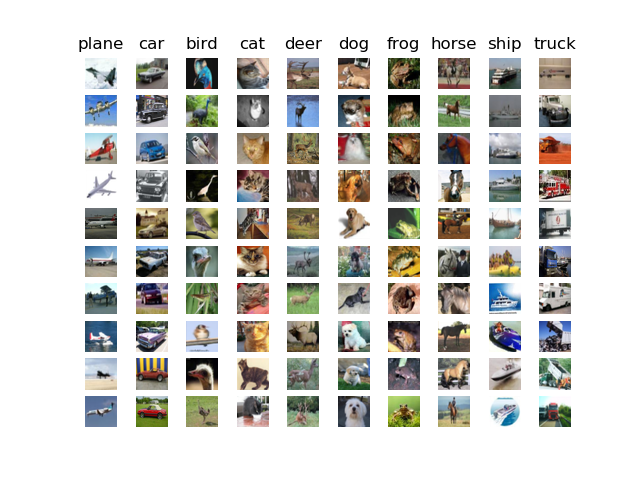

# Linear Classifier

This is a simple linear classifier using SVM on dataset [CIFAR-10](http://www.cs.toronto.edu/~kriz/cifar.html).

## CIFAR10 Dataset

## Files

- **linear_classifier.ipynb**: it's the main file and run on _jupyter notebook_ so that you can interactively execute each part of code.

- **data_utils.py**: this file contains functions to load the dataset in code.

- **gradient_check.py**: it do gradient check, i.e, it compares the gradient computed analytically with the numerically method.

- **classifiers/linear_svm.py**: here we calculate the SVM loss and gradient.

- **classifiers/linear_classifier.py**: it's the model itself, where we can train and predict.
